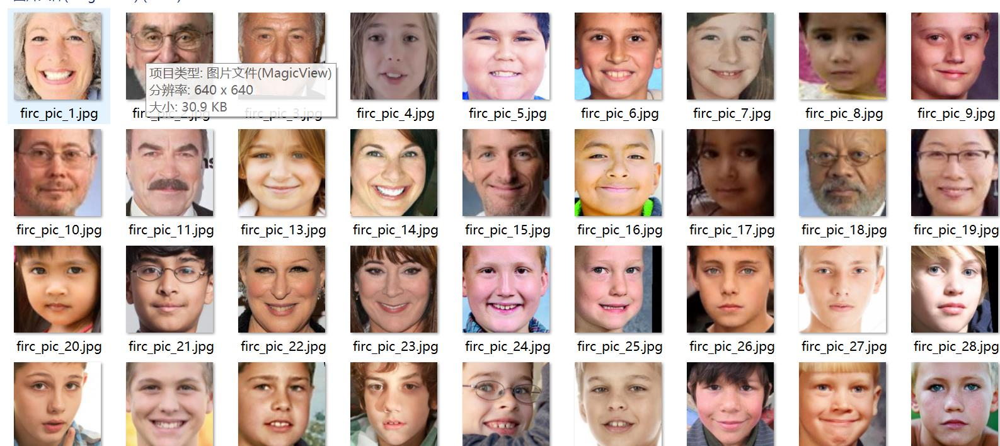
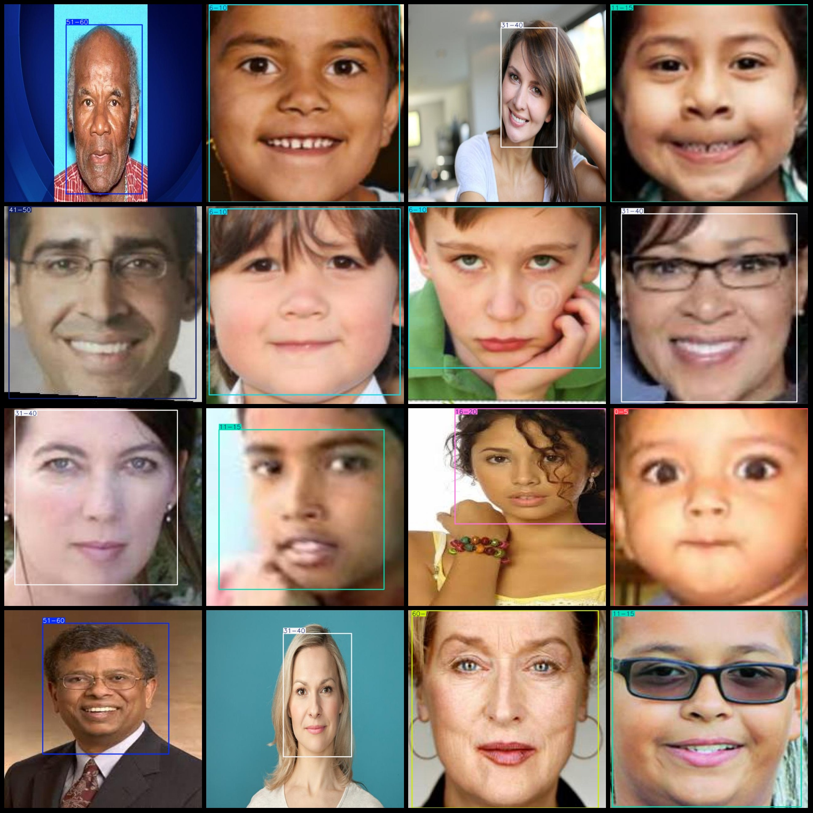
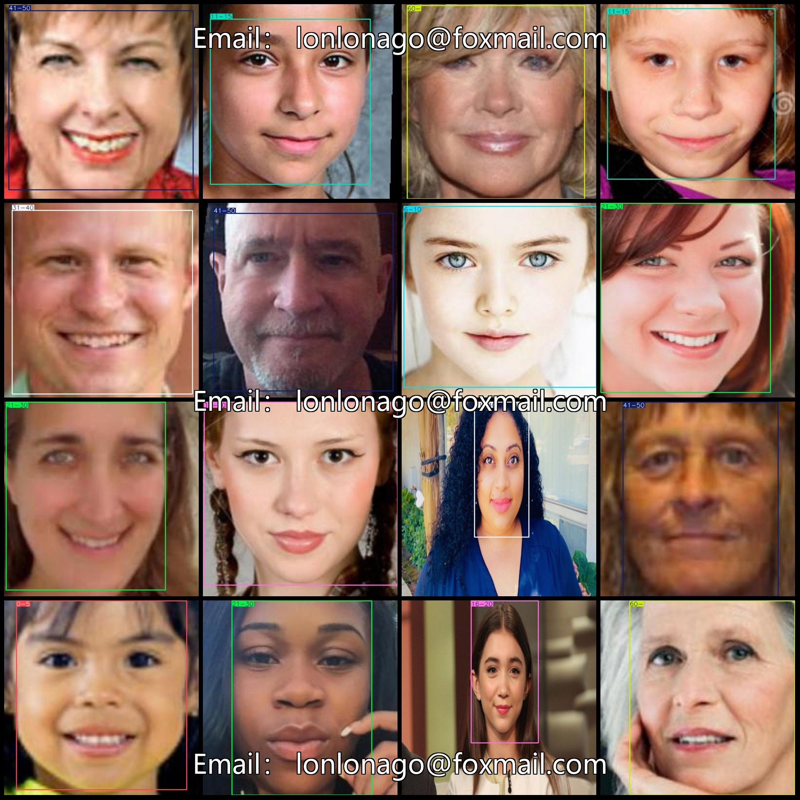

# Age Detection Age Classification Dataset with VOC+YOLO format and 2834 images in 9 categories

Dataset format: Pascal VOC format + YOLO format (without split path in txtfile, only containing jpgimage and corresponding VOC format xmlfile and yolo format txtfile)
number of images: 2834  
annotation count: 2834  
Number of TXT files: 2834
Label count: 9.
["0-5","6-10","11-15","16-20","21-30","31-40","41-50","51-60","60-"]
The number of boxes labeled per category:
0-5 box count = 186  
6-10 box count = 194  
11-15 box count = 398  
16-20 box count = 354  
21-30 Frames = 272
31-40 box count = 550  
41-50 box count = 336  
51-60 box count = 361  
60 - 198 = -138
Total frame count: 2850
images per class:   
0-5 images = 186  
6-10 images = 193  
11-15 images = 397  
16-20 images = 354
21-30 images = 272  
31-40 images = 548
41-50 images = 330  
51-60 images = 358
60- images = 198  
Image resolution: 640x640
Using a labeling tool: labelImg
Annotation rule: Draw a rectangle around the class.
Important Note: The dataset does not have a split for training, validation, and testing.
Special Statement: This dataset does not guarantee the accuracy of any trained models or weight files.
Preview of the image:
## Images

Here is a pay link on Stripe ( https://buy.stripe.com/3cs8yP7sY87d0vu9AB ). Please contact me lonlonago@foxmail.com after funding $89, and I will send you a complete data files , thank you!

